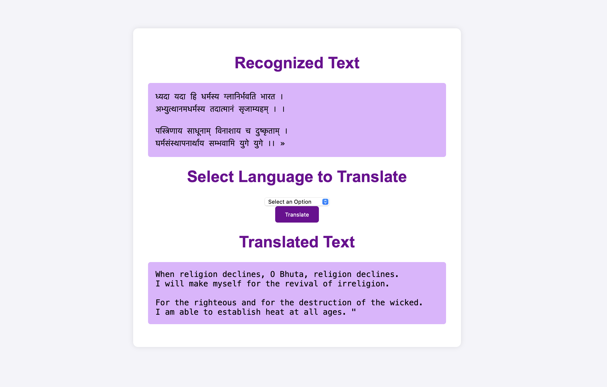

# Sanskrit Verse Translation Using Pytesseract OpenCv

This project is a web-based application that allows users to upload an image containing Sanskrit text, extract the text using Optical Character Recognition (OCR), and translate it into different languages.

## Features
- Upload an image containing Sanskrit text.
- Extract the text using Tesseract OCR.
- Translate the extracted text into Hindi, English, or other languages.
- Simple and intuitive web interface built using Flask.

## Technologies Used
- Python
- Flask (for web application)
- OpenCV (for image processing)
- Tesseract OCR (for text recognition)
- Google Translate API (for translation)
- HTML & CSS (for frontend)

## Installation

### Prerequisites
Ensure you have the following installed on your system:
- Python (>=3.7)
- Tesseract OCR (configured with Sanskrit language data)
- Required Python libraries (Flask, OpenCV, pytesseract, googletrans)

### Steps
1. Clone the repository:
   ```bash
    git clone https://github.com/your-username/sanskrit-ocr-translator.git
    cd sanskrit-ocr-translator

2. Install dependencies:
    ```bash
    pip install -r requirements.txt

3. Set up Tesseract OCR:
- Download and install Tesseract OCR from https://github.com/tesseract-ocr/tesseract


### Output:
<table>
  <tr>
    <td></td>
    <td></td>
  </tr>
  <tr>
    <td colspan="2"></td>
  </tr>
</table>


### Usage
1. Run the Flask application:
    ```bash
    python app.py
2. Open your web browser and go to http://127.0.0.1:5000/
3. Upload an image containing Sanskrit text.
4. View the extracted text and select a language for translation.
4. Get the translated text output.

## License
This project is licensed under the MIT License - see the LICENSE file for details.
